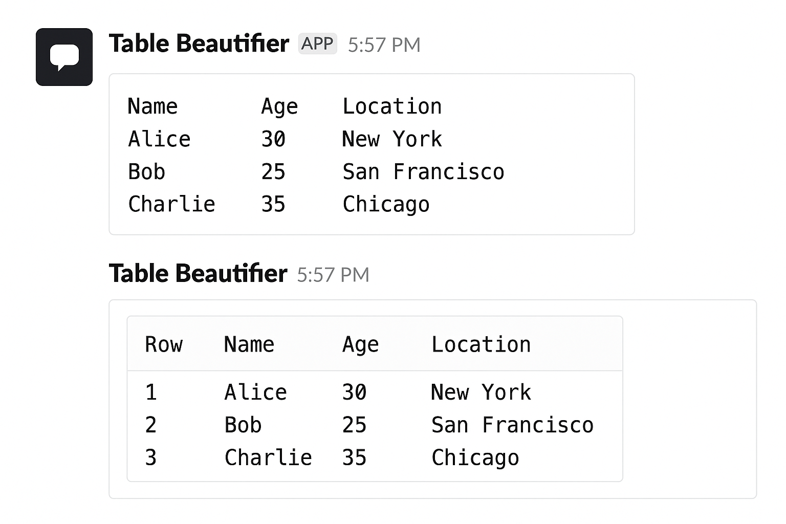

# Table Beautifier Slack Bot 📊

A powerful Slack bot that automatically detects, formats, and displays tabular data (CSV, TSV, etc.) into clean, scrollable snippets — no manual formatting required.

<!--  -->


---

## ⚡ Quickstart (Under 60 Seconds)

1. **Clone & Install Dependencies**
   ```sh
   git clone https://github.com/your-username/slack-table-beautifier-bot.git
   cd slack-table-beautifier-bot
   poetry install


2. **Add Environment Variables**
   Create `.env`:

   ```env
   SLACK_SIGNING_SECRET=your_signing_secret
   SLACK_CLIENT_ID=your_client_id
   SLACK_CLIENT_SECRET=your_client_secret
   ```

3. **Run Locally**

   ```sh
   PYTHONPATH=./src poetry run python -m main.tablebeautifier.bot.run_dev
   ```

4. **Expose to Slack**

   ```sh
   ngrok http 3000
   ```

   Update Slack App settings with your `ngrok` URL.

---

## 🚀 How It Works

The **Table Beautifier** listens for messages in channels, DMs, and threads.
When it detects something that looks like a table, it will:

1. **Isolate** the table from surrounding text.
2. **Parse & clean** it — handling multiple delimiters, irregular spacing, and messy rows.
3. **Add a row number column** if one isn't already present.
4. **Upload** the formatted data as a scrollable CSV snippet, preserving your original message context.

---

## ✨ Features

* **Automatic Snippet Creation** – Paste raw table data, get a clean CSV snippet instantly.
* **Slash Command** – `/csv` to explicitly format data.
* **Text Table Fallback** – Mention `@Table Beautifier` for a plain-text table.
* **Context Preservation** – Keeps text before/after the table intact.
* **Flexible Parsing** – Supports CSV, TSV, semicolon, and pipe-delimited data.
* **Works Everywhere** – Public/private channels, DMs, group DMs, and threads.

---

## 📂 Project Structure

```
slack-table-beautifier-bot/
├── .env
├── .gitignore
├── LICENSE
├── poetry.lock
├── pyproject.toml
├── README.md
└── src/
    └── main/
        └── tablebeautifier/
            ├── __init__.py
            ├── bot/
            │   ├── __init__.py
            │   └── app.py
            └── utils/
                ├── __init__.py
                └── table_formatter.py
```

---

## 🛠 Setup for Distribution

The bot is designed as a **public Slack App** using **OAuth 2.0**, requiring a **public URL** to receive events.

---

### 1️⃣ Configure Your Slack App

1. Go to [Slack API dashboard](https://api.slack.com/apps) → **"Create New App"** → **"From scratch"**.
2. Name it (e.g., `Table Beautifier`) → choose your workspace.
3. In **OAuth & Permissions**, add **Bot Token Scopes**:

    * `app_mentions:read`
    * `chat:write`
    * `commands`
    * `files:write`
4. In **Slash Commands**, create `/csv` (set Request URL later).
5. Get **Client ID**, **Client Secret**, and **Signing Secret** from **Basic Information**.

---

### 2️⃣ Local Environment Setup

1. Clone repo & enter:

   ```sh
   git clone https://github.com/your-username/slack-table-beautifier-bot.git
   cd slack-table-beautifier-bot
   ```
2. Install Poetry → [Guide](https://python-poetry.org/docs/#installation)
3. Install dependencies:

   ```sh
   poetry install
   ```
4. Create `.env`:

   ```env
   SLACK_SIGNING_SECRET=...
   SLACK_CLIENT_ID=...
   SLACK_CLIENT_SECRET=...
   ```
5. Add `.gitignore`:

   ```gitignore
   __pycache__/
   *.pyc
   .env
   /data/
   ```

---

### 3️⃣ Deploy to a Public Host

1. Deploy to **Render**, **Railway**, or similar.

    * Add `.env` vars in dashboard.
    * Start command:

      ```sh
      poetry run gunicorn "main.tablebeautifier.bot.app:server" --chdir ./src
      ```

2. Get your **Public URL** (e.g., `https://table-beautifier.onrender.com`).

3. Update Slack App:

    * **Redirect URL**:

      ```
      https://<YOUR_PUBLIC_URL>/slack/oauth/callback
      ```
    * **Event Subscriptions** → **Request URL**:

      ```
      https://<YOUR_PUBLIC_URL>/slack/events
      ```
    * Subscribe to:

      ```
      app_mention
      message.channels
      message.groups
      message.im
      message.mpim
      ```
    * **Interactivity & Shortcuts** → Request URL:

      ```
      https://<YOUR_PUBLIC_URL>/slack/events
      ```
    * **Slash Commands** → `/csv` → Request URL:

      ```
      https://<YOUR_PUBLIC_URL>/slack/events
      ```

---

## ☁ One-Click Render Deploy

[](https://render.com/deploy)

**Render Settings:**

* **Environment**: Python 3.x
* **Build Command**:

  ```sh
  poetry install
  ```
* **Start Command**:

  ```sh
  poetry run gunicorn "main.tablebeautifier.bot.app:server" --chdir ./src
  ```

---

### 4️⃣ Install & Run

#### Install in Workspace

Go to:

```
https://<YOUR_PUBLIC_URL>/slack/install
```

#### Local Testing

```sh
ngrok http 3000
PYTHONPATH=./src poetry run python -m main.tablebeautifier.bot.run_dev
```

---

## 🐞 Troubleshooting

* **"Invalid Request URL" in Slack** → Ensure ngrok/host URL is publicly reachable and uses HTTPS.
* **Tables not detected** → Check delimiter (commas, tabs, pipes, semicolons are supported).
* **Bot not responding** → Confirm it’s installed in the channel and has correct scopes.

---

## 📜 License

MIT — see [LICENSE](LICENSE) for details.
